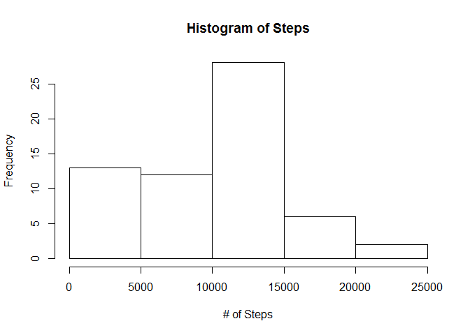

# Reproducible Research: Peer Assessment 1


## Loading and preprocessing the data

Show any code that is needed to

1. Load the data (i.e. read.csv())
2. Process/transform the data (if necessary) into a format suitable for your analysis


```r
library(lattice)

activity <- read.csv("./data/activity.csv")
activity$date <- as.Date(activity$date)
```


## What is mean total number of steps taken per day?

For this part of the assignment, you can ignore the missing values in the dataset.

1. Calculate the total number of steps taken per day
2. If you do not understand the difference between a histogram and a barplot, 
research the difference between them. Make a histogram of the total number of 
steps taken each day


```r
steps <- tapply(activity$steps, activity$date, sum)
hist(steps)
```

<!-- -->

3. Calculate and report the mean and median of the total number of steps taken per day.

Median:

```r
median(steps, na.rm = TRUE)
```

```
## [1] 10765
```

Mean:

```r
mean(steps, na.rm = TRUE)
```

```
## [1] 10766.19
```


## What is the average daily activity pattern?

1. Make a time series plot (i.e. type = "l") of the 5-minute interval (x-axis) 
and the average number of steps taken, averaged across all days (y-axis)


```r
avgSteps <- aggregate(steps ~ interval, data = activity, mean)
plot(avgSteps, type = "l", col = "blue")
```

<!-- -->

2. Which 5-minute interval, on average across all the days in the dataset, 
contains the maximum number of steps?


```r
avgSteps$interval[which.max(avgSteps$steps)]
```

```
## [1] 835
```

## Imputing missing values

1. Calculate and report the total number of missing values in the dataset 
(i.e. the total number of rows with NAs)


```r
sum(is.na(activity))
```

```
## [1] 2304
```

2. Devise a strategy for filling in all of the missing values in the dataset. 
The strategy does not need to be sophisticated. For example, you could use the 
mean/median for that day, or the mean for that 5-minute interval, etc.
3. Create a new dataset that is equal to the original dataset but with the 
missing data filled in.


```r
stepsPerDay <- tapply(activity$steps, activity$date, 
                      function (x) sum(x, na.rm = TRUE))
activityNew <- activity
for (i in 1:length(activityNew$steps)) {
    if (is.na(activityNew$steps[i])) {
        activityNew$steps[i] <- stepsPerDay[as.character(activityNew$date[i])]
    }
}
```

4. Make a histogram of the total number of steps taken each day and Calculate 
and report the mean and median total number of steps taken per day. 
Do these values differ from the estimates from the first part of the 
assignment? What is the impact of imputing missing data on the estimates of 
the total daily number of steps?


```r
stepsNew <- tapply(activityNew$steps, activityNew$date, sum)
hist(stepsNew, xlab = "# of Steps", main = "Histogram of Steps")
```

<!-- -->

The median before imputing:

```r
median(steps, na.rm = TRUE)
```

```
## [1] 10765
```
The median after imputing:

```r
median(stepsNew, na.rm = TRUE)
```

```
## [1] 10395
```

The mean before imputing:

```r
mean(steps, na.rm = TRUE)
```

```
## [1] 10766.19
```
The mean after imputing:

```r
mean(stepsNew, na.rm = TRUE)
```

```
## [1] 9354.23
```


## Are there differences in activity patterns between weekdays and weekends?

1. Create a new factor variable in the dataset with two levels - "weekday" and 
"weekend" indicating whether a given date is a weekday or weekend day.


```r
dayNames <- list(weekday = c("segunda-feira", "terça-feira", "quarta-feira", 
                 "quinta-feira", "sexta-feira"),
                 weekend = c("sábado", "domingo"))
activityNew$dayWeek <- factor(weekdays(activityNew$date))
levels(activityNew$dayWeek) <- dayNames
```

2. Make a panel plot containing a time series plot (i.e. type = "l") of the 
5-minute interval (x-axis) and the average number of steps taken, averaged 
across all weekday days or weekend days (y-axis). See the README file in the 
GitHub repository to see an example of what this plot should look like using 
simulated data.


```r
meanDayWeek <- tapply(activityNew$steps, activityNew$dayWeek, mean)
for (i in 1:nrow(activityNew)) {
    if(activityNew$dayWeek[i] == "weekend") {
        activityNew$steps[i] <- activityNew$steps[i] / meanDayWeek["weekend"]
    }
    else {
        activityNew$steps[i] <- activityNew$steps[i] / meanDayWeek["weekday"]
    }
}
avgStepsNew <- aggregate(steps ~ interval + dayWeek, data = activityNew, mean)

xyplot(steps ~ interval | dayWeek, type = 'l', data = avgStepsNew, 
       layout = c(1,2), main = "Average number of steps taken")
```

<!-- -->

